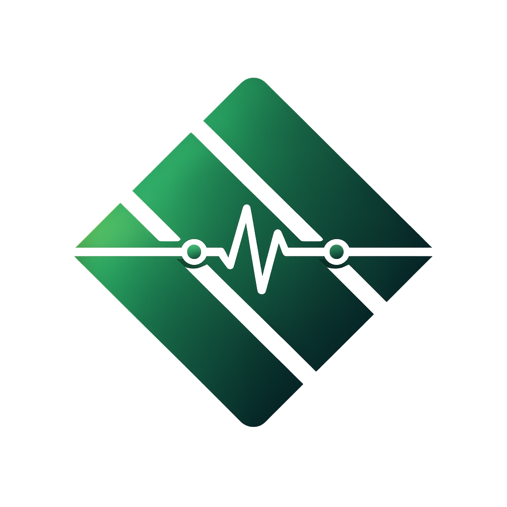
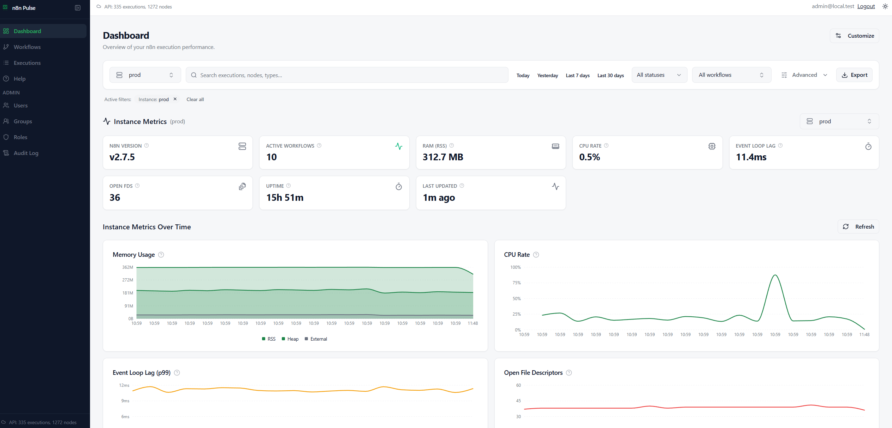
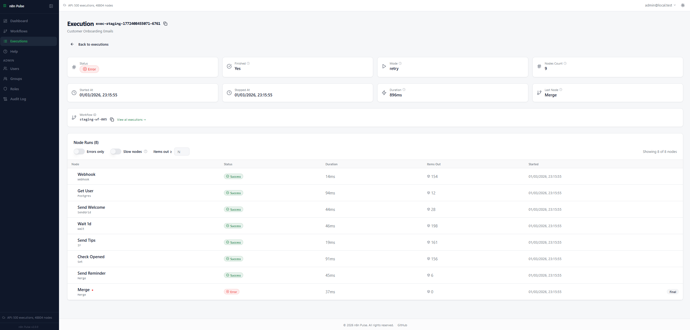

<p align="center">
  
</p>

<h1 align="center">n8n-trace</h1>

<p align="center">
  <strong>Self-hosted observability dashboard for n8n</strong><br>
  <em>Execution analytics • Instance metrics • RBAC • Audit logging</em>
</p>

<p align="center">
  <em><strong>This is an unofficial community project and not affiliated with n8n GmbH.</strong></em>
</p>

<p align="center">
  <a href="https://github.com/Mohammedaljer/n8nTrace/releases">
    
  </a>
  <a href="https://hub.docker.com/r/mohammedaljer/n8n-trace">
    
  </a>
  <a href="./LICENSE">
    
  </a>
  <a href="https://nodejs.org/">
    
  </a>
  <a href="https://www.postgresql.org/">
    
  </a>
</p>

<p align="center">
  
</p>

<p align="center">
  <a href="#quick-start">Quick Start</a> &nbsp;·&nbsp;
  <a href="#connect-n8n-to-n8n-trace">Connect n8n</a> &nbsp;·&nbsp;
  <a href="#features">Features</a> &nbsp;·&nbsp;
  <a href="#security">Security</a> &nbsp;·&nbsp;
  <a href="./docs/deployment.md">Deploy</a> &nbsp;·&nbsp;
  <a href="./docs/security.md">Security Guide</a> &nbsp;·&nbsp;
  <a href="./CONTRIBUTING.md">Contribute</a>
</p>

---

## What is n8n-trace?

n8n-trace is a self-hosted observability and analytics platform for n8n. It gives you execution analytics, instance health monitoring, a Prometheus-style metrics explorer, and role-based access control — purpose-built for production environments.

n8n-trace runs as a **single hardened Docker container** alongside PostgreSQL. It never makes outbound calls to your n8n instances. Data flows one way: n8n pushes to n8n-trace, not the other way around.

<p align="center">
  
</p>
<p align="center">
  
</p>

---

## Who is this for?

- **Teams self-hosting n8n** who need centralized visibility into what their workflows are doing.
- **Platform engineers** managing multiple n8n instances (prod, staging, dev) from a single unified dashboard.
- **Cross-functional Teams (e.g., Management, QA):** Departments that need to track workflow successes and failures without being exposed to sensitive payload data or underlying configurations.
- **Security-conscious organizations** that require audit logging, RBAC, and strict data privacy. n8n-trace intentionally excludes workflow payloads and raw error logs, ensuring GDPR compliance by design.
- **Anyone** who wants execution analytics without depending on n8n's built-in UI or paying for Enterprise roles just to get a "Viewer" access.


---

## Why n8n-trace alongside n8n?

n8n-trace **complements** n8n's built-in UI with enterprise observability features:

| Feature | n8n Built-in | n8n-trace |
|---------|--------------|-----------|
| **Node-level metrics (P95)** | ❌ | ✅ |
| **Multi-instance dashboard** | ❌ | ✅ |
| **Advanced RBAC (workflow scoping)** | Limited | ✅ Full |
| **Audit logging** | ❌ | ✅ |
| **Prometheus explorer** | ❌ | ✅ *(optional)* |
| **Viewer Role Access** | ❌ Enterprise only (sees payload) | ✅ Included (metadata only) |
| **Payload Privacy** | Execution logs expose sensitive data | ✅ 100% blind to payload & secrets |

**n8n-trace is your dedicated observability layer** — it works alongside n8n without replacing the workflow editor.


---

## Features

Core capabilities designed for production environments:

| Feature | Description |
|---------|-------------|
| **📊 Execution Analytics** | Success/failure rates, duration trends, node-level performance |
| **📈 Instance Monitoring** | CPU, memory, event loop metrics via Prometheus endpoint |
| **🔍 Metrics Explorer** | Query and chart any Prometheus metric with label filtering |
| **🧭 Multi-Instance** | Monitor prod, staging, dev from a single dashboard |
| **👥 Role-Based Access** | Admin, Analyst, Viewer roles with instance/workflow scoping |
| **🔒 Audit Logging** | All security events logged with configurable IP privacy |
| **🗑️ Data Retention** | Automatic cleanup of old execution data |
| **⬇️ CSV Export** | Export execution data and metrics for analysis |
| **📦 Single Container** | Google Distroless image — minimal attack surface |

---

## Quick Start

**Prerequisites:** Docker + Docker Compose v2+

```bash
git clone https://github.com/Mohammedaljer/n8nTrace.git
cd n8n-trace
cp .env.example .env
```

> [!IMPORTANT]
> Generate strong secrets:
> ```bash
> openssl rand -base64 24  # POSTGRES_PASSWORD
> openssl rand -base64 32  # JWT_SECRET
> ```

> [!NOTE]
> **Metrics optional**: Set `RETENTION_ENABLED: "false"` if you only want workflow executions. n8n-trace works without Prometheus metrics.

```bash
docker compose -f docker-compose.prod.yml up -d
```

Open `http://localhost:8899/setup` → create admin user.

> [!NOTE]
> **Metrics are optional.** If you don’t enable metrics collection on your n8n side, you can disable metrics features in n8n-trace too and still use execution analytics and workflow views.
>
> Set in `.env`:
> ```env
> METRICS_ENABLED="false"
> ```

---

## Connect n8n to n8n-trace

Data flows from n8n to n8n-trace via **two included n8n workflows** that write directly to the database.

### 1. Import workflows

Import these from the [`/Workflows`](./Workflows/) folder:

| Workflow | Purpose |
|----------|---------|
| [`n8n-trace-Execution-Collector.json`](./Workflows/n8n-trace-Execution-Collector.json) | Syncs executions and node data |
| [`metrics-snapshot.json`](./Workflows/metrics-snapshot.json) | Collects instance health metrics *(optional)* |

### 2. Configure database connection

Add to `.env`:
```bash
TRACE_INGEST_USER=trace_ingest
TRACE_INGEST_PASSWORD=<your-strong-password>
```

Configure PostgreSQL node in each workflow with `trace_ingest` credentials.

---

## Architecture

```
┌─────────────┐      ┌────────────────────────────────────┐
│   n8n       │      │           n8n-trace                │
│  Instance   │ ───► │  ┌──────────┐  ┌────────────────┐  │
│             │      │  │PostgreSQL│◄─│ Express + SPA  │  │
│  (writes    │      │  │  :5432   │  │     :8899      │  │
│   via       │      │  └──────────┘  └────────────────┘  │
│   ingest)   │      └────────────────────────────────────┘
└─────────────┘                     ▲
                                    │ HTTPS
                               Your Browser
```

- **Single container** — Express.js serves the React SPA and REST API (Google Distroless, Node.js 22)
- **Push-based ingestion** — n8n workflows write directly to PostgreSQL; Trace never calls n8n

See the [Architecture Guide](./docs/architecture.md) for the full request flow, proxy trust model, and deployment topologies.

---

## Security

n8n Trace is designed for production self-hosting with defense-in-depth:

| Layer | Implementation |
|-------|---------------|
| 🐳 **Container** | Google Distroless (no shell, no package manager), non-root UID, read-only filesystem |
| 🛡️ **Headers** | Strict CSP via Helmet (`default-src 'self'`, `frame-ancestors 'none'`) |
| 🔐 **Auth** | JWT in HttpOnly/Secure/SameSite cookies, bcrypt password hashing |
| 🚫 **Brute Force** | Account lockout (10 attempts / 15-min lock) + per-IP rate limiting |
| 🔑 **Passwords** | 12-char minimum, ~60-entry common-password denylist |
| ♻️ **Sessions** | Token versioning with "Log out all devices" + admin session revocation |
| 🧱 **CSRF** | Origin/Referer validation on all mutating `/api/` endpoints |
| 🕵️ **Privacy** | GDPR-compliant audit logs with configurable IP handling (raw / hashed / none) |
| 🗄️ **Database** | Least-privilege ingest user, parameterized SQL, no string concatenation |
| 🚦 **Startup** | Fail-fast checks reject insecure configs in production |

> [!WARNING]
> In production, always set `COOKIE_SECURE=true`, use HTTPS, and ensure `CORS_ORIGIN` is an exact URL (not `*`). Trace enforces this — it will refuse to start with insecure settings.

See the full [Security Guide](./docs/security.md).

---
## Docker Hub

<p align="center">
  <a href="https://hub.docker.com/r/mohammedaljer/n8n-trace">
    
  </a>
</p>

```yaml
services:
  app:
    image: mohammedaljer/n8n_Trace:v2.0.0
```

> [!NOTE]
> **Upgrading from v1.x?** The separate `n8n_Trace_backend` and `n8n_Trace_frontend` images are deprecated. Use the single unified image `mohammedaljer/n8n_Trace:v2.0.0`. See the [Deployment Guide](./docs/deployment.md).

---

## RBAC

| Role | Access |
|------|--------|
| **Admin** | Full access — users, groups, roles, audit logs, retention, all data and metrics |
| **Analyst** | Read + export — dashboards, full metrics, CSV export |
| **Viewer** | Read-only — dashboards and version info only |

Non-admin users can be scoped to specific instances, workflows, or tags. Instance-level metrics (CPU, RAM) require explicit instance scope — tag or workflow scopes alone do not grant infrastructure visibility.

See [RBAC Guide](./docs/rbac.md) for groups, scopes, and the full permission matrix.

---

## Environment Variables

### Required

| Variable | Description |
|----------|-------------|
| `POSTGRES_PASSWORD` | Database password (`openssl rand -base64 24`) |
| `JWT_SECRET` | JWT signing key, min 32 chars (`openssl rand -base64 32`) |

### Security

| Variable | Default | Description |
|----------|---------|-------------|
| `COOKIE_SECURE` | `true` | Require HTTPS for auth cookies |
| `CORS_ORIGIN` | — | Exact frontend URL (no trailing slash, no wildcard) |
| `PASSWORD_MIN_LENGTH` | `12` | Minimum password length |
| `ACCOUNT_LOCKOUT_THRESHOLD` | `10` | Failed login attempts before lockout |
| `ACCOUNT_LOCKOUT_DURATION_MINUTES` | `15` | Lockout duration in minutes |
| `AUDIT_LOG_IP_MODE` | `raw` | IP storage mode: `raw`, `hashed`, `none` |

See [`.env.example`](.env.example) for all options, or the [Environment Reference](./docs/environment.md).

---

## Documentation

| Guide | Description |
|-------|------------|
| 🚀 [Getting Started](./docs/getting-started.md) | Local setup and first steps |
| 🏗️ [Architecture](./docs/architecture.md) | Request flow, trust model, deployment topologies |
| 🐳 [Deployment](./docs/deployment.md) | Production Docker, Portainer, reverse proxy |
| ⚙️ [Configuration](./docs/configuration.md) | All environment variables explained |
| 🧠 [Backend](./docs/backend.md) | API reference, database schema, migrations |
| 🎨 [Frontend](./docs/frontend.md) | React components, routing, widget system |
| 🔒 [Security](./docs/security.md) | CSP, lockout, passwords, audit logging, GDPR |
| 👥 [RBAC](./docs/rbac.md) | Roles, groups, scopes, permission matrix |
| 🌍 [Environment](./docs/environment.md) | Docker environment variable reference |
| 🔄 [Workflows](./Workflows/README.md) | n8n collector workflow setup and design |
| 🛠️ [Troubleshooting](./docs/troubleshooting.md) | Common issues and solutions |

---

## Health Check

```bash
curl http://localhost:8899/health
# {"ok":true,"db":"connected"}
```

The `/health` and `/ready` endpoints require no authentication — use them for Docker health checks, Kubernetes probes, or uptime monitoring.

---

## Contributing

Contributions are welcome. See [CONTRIBUTING.md](./CONTRIBUTING.md) for guidelines.

<p align="center">
  <a href="https://github.com/Mohammedaljer/n8nTrace/fork">
    
  </a>
  &nbsp;
  <a href="https://github.com/Mohammedaljer/n8nTrace/issues/new/choose">
    
  </a>
  &nbsp;
  <a href="https://github.com/Mohammedaljer/n8nTrace/pulls">
    
  </a>
  &nbsp;
  <a href="https://github.com/Mohammedaljer/n8nTrace/stargazers">
    
  </a>
</p>

---

## License

[MIT](./LICENSE) © 2026 Mohammed Aljer

---


<p align="center"> 
  <em>Built for n8n community • <strong>Unofficial project, not affiliated with n8n GmbH</strong></em><br>
  <span style="font-size: 0.9em; color: gray;">Brought to life with the assistance of modern AI coding tools.</span>
</p>
