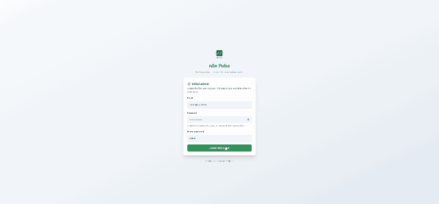

<p align="center">
  
</p>

<h1 align="center">n8n Pulse</h1>

<p align="center">
  <strong>Self-hosted observability dashboard for n8n — execution analytics, instance metrics, and role-based access control.</strong>
</p>

<p align="center">
  <a href="https://github.com/Mohammedaljer/n8nPulse/releases">
    
  </a>
  <a href="https://hub.docker.com/r/mohammedaljer/n8n_pulse">
    
  </a>
  <a href="./LICENSE">
    
  </a>
  <a href="https://nodejs.org/">
    
  </a>
  <a href="https://www.postgresql.org/">
    
  </a>
</p>

<p align="center">
  
</p>

<p align="center">
  <a href="#quick-start">Quick Start</a> &nbsp;·&nbsp;
  <a href="#connect-n8n-to-pulse">Connect n8n</a> &nbsp;·&nbsp;
  <a href="#features">Features</a> &nbsp;·&nbsp;
  <a href="#security">Security</a> &nbsp;·&nbsp;
  <a href="./docs/deployment.md">Deploy</a> &nbsp;·&nbsp;
  <a href="./docs/security.md">Security Guide</a> &nbsp;·&nbsp;
  <a href="./CONTRIBUTING.md">Contribute</a>
</p>

---

## What is n8n Pulse?

n8n Pulse is a self-hosted observability and analytics platform for n8n. It gives you execution analytics, instance health monitoring, a Prometheus-style metrics explorer, and role-based access control — purpose-built for production environments.

Pulse runs as a **single hardened Docker container** alongside PostgreSQL. It never makes outbound calls to your n8n instances. Data flows one way: n8n pushes to Pulse, not the other way around.

<p align="center">
  
</p>
<p align="center">
  
</p>

---

## Who is this for?

- **Teams self-hosting n8n** who need visibility into what their workflows are doing
- **Platform engineers** managing multiple n8n instances (prod, staging, dev) from one place
- **Security-conscious organizations** that require audit logging, RBAC, and GDPR-compliant data handling
- **Anyone** who wants execution analytics without depending on n8n's built-in UI

---

## Why not just use n8n's built-in UI?

| | n8n Built-in | n8n Pulse |
|---|:---:|:---:|
| Execution list | Yes | Yes |
| Success/failure rates over time | No | Yes |
| Node-level performance (P95, durations) | No | Yes |
| CPU / memory / event loop monitoring | No | Yes |
| Prometheus metrics explorer | No | Yes |
| Multi-instance single dashboard | No | Yes |
| Role-based access control | Limited | Full (Admin / Analyst / Viewer + scoping) |
| Audit logging with IP privacy | No | Yes |
| Data retention policies | No | Yes |
| CSV export | No | Yes |
| Zero access to n8n credentials | N/A | Yes — Pulse never calls n8n |

n8n Pulse is **not** a replacement for the n8n editor. It is a dedicated observability layer that sits alongside your n8n deployment.

---

## Features
Core capabilities designed for production environments:

| Feature | Description |
|---------|-------------|
| **📊 Execution Analytics** | Success/failure rates, duration trends, node-level performance |
| **📈 Instance Monitoring** | CPU, memory, event loop metrics via Prometheus endpoint |
| **🔍 Metrics Explorer** | Query and chart any Prometheus metric with label filtering and aggregation |
| **🧭 Multi-Instance** | Monitor prod, staging, dev from a single dashboard |
| **👥 Role-Based Access** | Admin, Analyst, Viewer roles with instance/workflow/tag scoping |
| **🔒 Audit Logging** | All security events logged with configurable IP privacy (raw, hashed, none) |
| **🗑️ Data Retention** | Automatic cleanup of old execution data on a configurable schedule |
| **⬇️ CSV Export** | Export execution data and metrics for external analysis |
| **📦 Single Container** | Google Distroless image — no shell, no package manager, minimal attack surface |
| **🔄 Auto-Migrations** | Database schema upgrades run automatically on startup |

---

## Quick Start

**Prerequisites:** Docker + Docker Compose v2+

```bash
git clone https://github.com/Mohammedaljer/n8nPulse.git
cd n8nPulse
cp .env.example .env
```

> [!IMPORTANT]
> You **must** generate strong secrets before starting. Pulse refuses to start in production with weak or placeholder values.

```bash
# Generate and paste into .env
openssl rand -base64 24   # → POSTGRES_PASSWORD
openssl rand -base64 32   # → JWT_SECRET (min 32 chars)
```

```bash
docker compose -f docker-compose.prod.yml up -d
```

Open **http://localhost:8899/setup** and create the first admin user.

> [!NOTE]
> The `/setup` page is only accessible when zero users exist in the database. After the first admin is created, it is permanently disabled.

---

## Connect n8n to Pulse

Data flows from n8n to Pulse via **two included n8n workflows** that write directly to the Pulse database. Pulse never calls n8n.

### 1. Import the workflows

Import these from the [`/Workflows`](./Workflows/) folder into your n8n instance:

| Workflow | Purpose |
|----------|---------|
| [`Pulse-Execution-Collector.json`](./Workflows/Pulse-Execution-Collector.json) | Syncs executions, node-level data, and workflow metadata |
| [`metrics-snapshot.json`](./Workflows/metrics-snapshot.json) | Collects instance health metrics (CPU, memory, event loop) |

### 2. Configure the database connection

Both workflows use a **restricted ingest user** with least-privilege access (INSERT/UPDATE only — no access to user accounts or audit logs).

Add to your `.env`:

```bash
PULSE_INGEST_USER=pulse_ingest
PULSE_INGEST_PASSWORD=<your-strong-password>
```

Configure the PostgreSQL node in each workflow:

| Field | Value |
|-------|-------|
| Host | Your Pulse PostgreSQL host (e.g., `postgres` on Docker network) |
| Port | `5432` |
| Database | `n8n_pulse` |
| User | `pulse_ingest` |
| Password | Value of `PULSE_INGEST_PASSWORD` |

### 3. Activate both workflows

Data will appear in your dashboard within minutes.

> [!TIP]
> See the [Workflows README](./Workflows/README.md) for flow diagrams, captured metrics, scheduling options, and design details.

---

## Architecture
n8n Pulse follows a strict push-based, zero-trust architecture:
```text
┌─────────────┐      ┌────────────────────────────────────┐
│   n8n       │      │           n8n Pulse                │
│  Instance   │      │  ┌──────────┐  ┌────────────────┐  │
│             │ ───► │  │PostgreSQL│◄─│ Express + SPA  │  │
│  (writes    │      │  │  :5432   │  │    :8899       │  │
│   via       │      │  └──────────┘  └────────────────┘  │
│   ingest)   │      └────────────────────────────────────┘
└─────────────┘                           ▲
                                          │ HTTPS
                                     Your Browser
```

- **Single container** — Express.js serves the React SPA and REST API (Google Distroless, Node.js 22)
- **Push-based ingestion** — n8n workflows write directly to PostgreSQL; Pulse never calls n8n
- **Two containers total** — the app + PostgreSQL. No NGINX, no sidecars.

See the [Architecture Guide](./docs/architecture.md) for the full request flow, proxy trust model, and deployment topologies.

---

## Security

n8n Pulse is designed for production self-hosting with defense-in-depth:

| Layer | Implementation |
|-------|---------------|
| 🐳 **Container** | Google Distroless (no shell, no package manager), non-root UID, read-only filesystem |
| 🛡️ **Headers** | Strict CSP via Helmet (`default-src 'self'`, `frame-ancestors 'none'`) |
| 🔐 **Auth** | JWT in HttpOnly/Secure/SameSite cookies, bcrypt password hashing |
| 🚫 **Brute Force** | Account lockout (10 attempts / 15-min lock) + per-IP rate limiting |
| 🔑 **Passwords** | 12-char minimum, ~60-entry common-password denylist |
| ♻️ **Sessions** | Token versioning with "Log out all devices" + admin session revocation |
| 🧱 **CSRF** | Origin/Referer validation on all mutating `/api/` endpoints |
| 🕵️ **Privacy** | GDPR-compliant audit logs with configurable IP handling (raw / hashed / none) |
| 🗄️ **Database** | Least-privilege ingest user, parameterized SQL, no string concatenation |
| 🚦 **Startup** | Fail-fast checks reject insecure configs in production |

> [!WARNING]
> In production, always set `COOKIE_SECURE=true`, use HTTPS, and ensure `CORS_ORIGIN` is an exact URL (not `*`). Pulse enforces this — it will refuse to start with insecure settings.

See the full [Security Guide](./docs/security.md).

---

## Docker Hub

<p align="center">
  <a href="https://hub.docker.com/r/mohammedaljer/n8n_pulse">
    
  </a>
</p>

```yaml
services:
  app:
    image: mohammedaljer/n8n_pulse:v2.0.0
```

> [!NOTE]
> **Upgrading from v1.x?** The separate `n8n_pulse_backend` and `n8n_pulse_frontend` images are deprecated. Use the single unified image `mohammedaljer/n8n_pulse:v2.0.0`. See the [Deployment Guide](./docs/deployment.md).

---

## RBAC

| Role | Access |
|------|--------|
| **Admin** | Full access — users, groups, roles, audit logs, retention, all data and metrics |
| **Analyst** | Read + export — dashboards, full metrics, CSV export |
| **Viewer** | Read-only — dashboards and version info only |

Non-admin users can be scoped to specific instances, workflows, or tags. Instance-level metrics (CPU, RAM) require explicit instance scope — tag or workflow scopes alone do not grant infrastructure visibility.

See [RBAC Guide](./docs/rbac.md) for groups, scopes, and the full permission matrix.

---

## Environment Variables

### Required

| Variable | Description |
|----------|-------------|
| `POSTGRES_PASSWORD` | Database password (`openssl rand -base64 24`) |
| `JWT_SECRET` | JWT signing key, min 32 chars (`openssl rand -base64 32`) |

### Security

| Variable | Default | Description |
|----------|---------|-------------|
| `COOKIE_SECURE` | `true` | Require HTTPS for auth cookies |
| `CORS_ORIGIN` | — | Exact frontend URL (no trailing slash, no wildcard) |
| `PASSWORD_MIN_LENGTH` | `12` | Minimum password length |
| `ACCOUNT_LOCKOUT_THRESHOLD` | `10` | Failed login attempts before lockout |
| `ACCOUNT_LOCKOUT_DURATION_MINUTES` | `15` | Lockout duration in minutes |
| `AUDIT_LOG_IP_MODE` | `raw` | IP storage mode: `raw`, `hashed`, `none` |

See [`.env.example`](.env.example) for all options, or the [Environment Reference](./docs/environment.md).

---

## Documentation

| Guide | Description |
|-------|------------|
| 🚀 [Getting Started](./docs/getting-started.md) | Local setup and first steps |
| 🏗️ [Architecture](./docs/architecture.md) | Request flow, trust model, deployment topologies |
| 🐳 [Deployment](./docs/deployment.md) | Production Docker, Portainer, reverse proxy |
| ⚙️ [Configuration](./docs/configuration.md) | All environment variables explained |
| 🧠 [Backend](./docs/backend.md) | API reference, database schema, migrations |
| 🎨 [Frontend](./docs/frontend.md) | React components, routing, widget system |
| 🔒 [Security](./docs/security.md) | CSP, lockout, passwords, audit logging, GDPR |
| 👥 [RBAC](./docs/rbac.md) | Roles, groups, scopes, permission matrix |
| 🌍 [Environment](./docs/environment.md) | Docker environment variable reference |
| 🔄 [Workflows](./Workflows/README.md) | n8n collector workflow setup and design |
| 🛠️ [Troubleshooting](./docs/troubleshooting.md) | Common issues and solutions |

---

## Health Check

```bash
curl http://localhost:8899/health
# {"ok":true,"db":"connected"}
```

The `/health` and `/ready` endpoints require no authentication — use them for Docker health checks, Kubernetes probes, or uptime monitoring.

---

## Contributing

Contributions are welcome. See [CONTRIBUTING.md](./CONTRIBUTING.md) for guidelines.

<p align="center">
  <a href="https://github.com/Mohammedaljer/n8nPulse/fork">
    
  </a>
  &nbsp;
  <a href="https://github.com/Mohammedaljer/n8nPulse/issues/new/choose">
    
  </a>
  &nbsp;
  <a href="https://github.com/Mohammedaljer/n8nPulse/pulls">
    
  </a>
  &nbsp;
  <a href="https://github.com/Mohammedaljer/n8nPulse/stargazers">
    
  </a>
</p>

---

## License

[MIT](./LICENSE) © 2026 Mohammed Aljer

<p align="center">
  <em>Built for the n8n community.</em>
</p>
