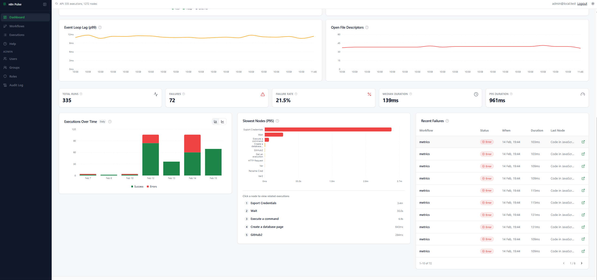

<p align="center">
  
</p>

<h1 align="center">n8n Pulse</h1>

<p align="center">
  <strong>Self-hosted analytics dashboard for n8n workflows, executions & metrics</strong>
</p>

<p align="center">
  <a href="#features">Features</a> •
  <a href="#quick-start">Quick Start</a> •
  <a href="#docker-hub">Docker Hub</a> •
  <a href="#documentation">Documentation</a> •
  <a href="./docs/deployment.md">Deploy</a> •
  <a href="./LICENSE">License</a>
</p>

<p align="center">
  <a href="https://github.com/Mohammedaljer/n8nPulse/releases">
    
  </a>
  <a href="./LICENSE">
    
  </a>
  <a href="https://nodejs.org/en/download/">
    
  </a>
  <a href="https://www.postgresql.org/download/">
    
  </a>
</p>

---
## About this project

This is my first project built with **vibe coding** (AI-assisted development). The goal is to ship a useful, self-hosted analytics dashboard for the n8n community, and improve it iteratively with feedback.

If you find bugs, unclear docs, or security issues, please open an issue or a PR — contributions are welcome.

---

## Data ingestion (required)

n8n Pulse doesn’t “magically” have data by itself — you need an **n8n workflow** that collects execution/instance data and inserts it into the Pulse database.

---
<p align="center">
  
</p>

---

<p align="center">
  
</p>

---

## Features

| Feature | Description |
|---------|-------------|
| 📊 **Execution Analytics** | Success/failure rates, duration trends, node-level performance |
| 📈 **Instance Monitoring** | CPU, memory, event loop metrics from n8n instances |
| 👥 **Role-Based Access** | Admin, Analyst, Viewer roles with instance scoping |
| 🔒 **Audit Logging** | Security events with configurable IP privacy (GDPR) |
| 🗑️ **Data Retention** | Automatic cleanup of old execution data |
| 🛡️ **Secure by Default** | JWT + HttpOnly cookies, fail-fast production checks |

---

## Quick Start

### Requirements
- Docker + Docker Compose

### Option A: Use prebuilt images (recommended)

Go to your project folder (where your `docker-compose.yml` is) and run:

```bash
docker compose pull
docker compose up -d
```

Open:
- http://localhost:8899

### Option B: Build from source

```bash
git clone https://github.com/Mohammedaljer/n8nPulse.git
cd n8nPulse

docker compose up -d --build
```

Open:
- http://localhost:8899

### First Run

Navigate to:
- http://localhost:8899/setup

> The `/setup` page is only accessible when no users exist in the database.

---

## Docker Hub

<p align="center">
  <a href="https://hub.docker.com/r/mohammedaljer/n8n_pulse_backend">
    
  </a>
  <a href="https://hub.docker.com/r/mohammedaljer/n8n_pulse_frontend">
    
  </a>
</p>

Your `docker-compose.yml` should reference these images:

```yaml
services:
  backend:
    image: mohammedaljer/n8n_pulse_backend:latest
  frontend:
    image: mohammedaljer/n8n_pulse_frontend:latest
```

---

## Production Deployment

```bash
cp .env.example .env
nano .env  # Set JWT_SECRET, POSTGRES_PASSWORD, APP_URL

docker compose -f docker-compose.prod.yml up -d --build
```

See [Deployment Guide](./docs/deployment.md) for complete instructions.

---

## n8n Integration

n8n Pulse receives data directly from n8n via a **restricted database user**:

```bash
# Set in .env
PULSE_INGEST_USER=pulse_ingest
PULSE_INGEST_PASSWORD=<your-password>
```

The ingest user can **only** write to execution tables—no access to user accounts or audit logs.

See [Backend Architecture](./docs/backend.md#n8n-data-ingestion) for setup details.

---

## Architecture

```text
┌─────────────┐      ┌────────────────────────────────────────────┐
│   n8n       │      │                 n8n Pulse                  │
│  Instance   │      │  ┌──────────┐  ┌──────────┐  ┌──────────┐  │
│             │ ───► │  │PostgreSQL│◄─│ Backend  │◄─│ Frontend │  │
│  (writes    │      │  │  :5432   │  │  :8001   │  │  :8899   │  │
│   via       │      │  └──────────┘  └──────────┘  └──────────┘  │
│   ingest)   │      └────────────────────────────────────────────┘
└─────────────┘                           ▲
                                          │ HTTPS
                                     Your Browser
```

---

## Documentation

| Guide | Description |
|-------|-------------|
| [📖 Getting Started](./docs/getting-started.md) | Local setup and first steps |
| [🚀 Deployment](./docs/deployment.md) | Production, Docker, Portainer, environment variables |
| [⚙️ Configuration](./docs/configuration.md) | All environment variables explained |
| [🔧 Backend](./docs/backend.md) | API, database schema, migrations |
| [🎨 Frontend](./docs/frontend.md) | React components, routing |
| [🔒 Security](./docs/security.md) | Secrets, proxy, audit logging, GDPR |
| [👥 RBAC](./docs/rbac.md) | Roles and permissions |
| [🔍 Troubleshooting](./docs/troubleshooting.md) | Common issues |

---

## Environment Variables

### Required

| Variable | Description |
|----------|-------------|
| `POSTGRES_PASSWORD` | Database password |
| `JWT_SECRET` | Min 32 chars for session signing |

### Security

| Variable | Recommended | Description |
|----------|-------------|-------------|
| `COOKIE_SECURE` | `true` | HTTPS only cookies |
| `CORS_ORIGIN` | Your URL | Exact frontend URL |
| `AUDIT_LOG_IP_MODE` | `hashed` | GDPR-compliant IP storage |

See [.env.example](.env.example) for all options with detailed explanations.

---

## RBAC Roles

| Role | Access |
|------|--------|
| **Admin** | Full access: users, audit logs, all data |
| **Analyst** | Read + export: view data, export to CSV |
| **Viewer** | Read-only: dashboards only |

---

## Health Checks

```bash
curl http://localhost:8899/health
# {"ok":true,"db":"connected"}
```

---

## 🤝 Contributing

<p align="center">
  <a href="https://github.com/Mohammedaljer/n8nPulse/fork">
    
  </a>
  &nbsp;&nbsp;
  <a href="https://github.com/Mohammedaljer/n8nPulse/issues/new/choose">
    
  </a>
  &nbsp;&nbsp;
  <a href="https://github.com/Mohammedaljer/n8nPulse/pulls">
    
  </a>
  &nbsp;&nbsp;
  <a href="https://github.com/Mohammedaljer/n8nPulse/stargazers">
    
  </a>
</p>

**Fork → Modify → Push → Pull Request**

1. 🌐 Fork the repo: https://github.com/Mohammedaljer/n8nPulse/fork
2. 🔄 Create a branch: `git checkout -b feature/my-new-feature`
3. 💾 Commit changes: `git commit -m "Add: my new feature"`
4. 📤 Push branch: `git push origin feature/my-new-feature`
5. 🚀 Open a PR: https://github.com/Mohammedaljer/n8nPulse/compare

Tip: If you add a `CONTRIBUTING.md`, GitHub will surface it automatically to contributors.

---

## License

[MIT](./LICENSE) © n8n Pulse Contributors

---

<p align="center">
  <em>Built for the n8n community — Star the repo if it helped you.</em>
</p>
