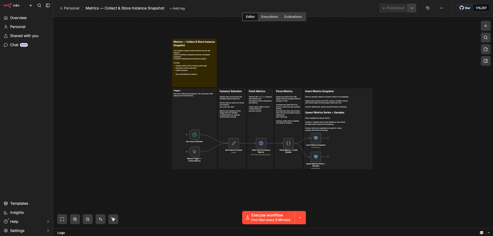
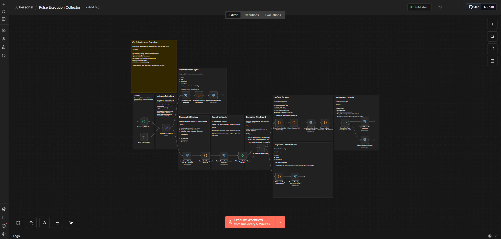

  

<h1 align="center">n8n Pulse Workflows</h1>

  <em>This document describes the core workflows used by n8n Pulse</em>

---

## Metrics — Collect & Store Instance Snapshot

**Workflow file:**

[Metrics Workflow JSON](./metrics-snapshot.json)

**Screenshot:**

### Purpose

Collects runtime metrics from an n8n instance via the Prometheus `/metrics` endpoint and stores both:

- Periodic snapshot summaries
- Detailed time-series metrics

This provides full observability into instance health and performance.

### Flow Summary

1. Triggered manually or on schedule.
2. Sets instance context (e.g. `prod`).
3. Calls the `/metrics` endpoint.
4. Parses Prometheus metrics.
5. Extracts runtime indicators.
6. Inserts snapshot summary.
7. Upserts metric series definitions.
8. Inserts metric samples for time-series tracking.

### Captured Metrics

* n8n version
* Node.js version
* CPU usage
* Memory usage
* Event loop lag
* Open file descriptors
* Active workflows
* Leader status
* Process start time

### Metrics Storage Model

The workflow writes metrics using two layers:

- **Snapshot** → aggregated state for dashboards
- **Series + Samples** → raw metrics for charts and analysis

The *Upsert Metrics Series + Samples* step:

- Creates or updates metric series metadata
- Maintains stable series identity using labels hash
- Inserts timestamped metric values
- Updates values if the same timestamp already exists
- Ensures idempotent ingestion

### Why it matters

Used to power:

* Performance dashboards
* Metrics Explorer
* Time-series graphs
* Capacity monitoring
* Health checks
* Historical analysis

---

## Pulse Execution Collector

**Workflow file:**

[Pulse Execution Collector JSON](./Pulse-Execution-Collector.json)

**Screenshot:**

### Purpose

Synchronizes executions and workflow metadata from n8n into the Pulse database using incremental ingestion.

Designed for near real-time observability with minimal database load.

### Flow Summary

#### Execution Sync

* Reads last checkpoint
* Detects new executions
* Refreshes running executions
* Fetches execution headers

#### Size Guard

Execution payloads are evaluated:

* Small → full parsing (runData + nodes)
* Large → summary only

#### Deep Parsing

For eligible executions:

* Decode runData
* Extract node runs
* Compute durations
* Count items
* Track last executed node

#### Database Writes

* Upsert execution summaries
* Upsert node details
* Maintain idempotency

#### Workflow Index Sync

Updates metadata including:

* Workflow name
* Tags
* Active status
* Archive state
* Node types
* Node count

### Design Goals

* Incremental processing
* Safe retries
* No duplicates
* Efficient database usage
* Continuous operation

### Why it matters

Enables:

* Execution timelines
* Failure investigation
* Node performance insights
* Workflow inventory
* Operational dashboards

---

## Notes

* Both workflows support manual runs for testing.
* Instance ID allows multi-environment monitoring (prod/dev/test).
* Designed to run continuously in production.