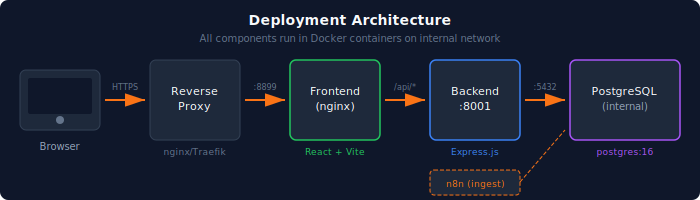

# Production Deployment

Deploy n8n Pulse securely in production.

<!-- TOC -->

- [Production Deployment](#production-deployment)
  - [Architecture](#architecture)
  - [Quick Start](#quick-start)
    - [Option 1: Build from Source](#option-1-build-from-source)
    - [Option 2: Pre-built Images (Portainer)](#option-2-pre-built-images-portainer)
  - [Environment Variables Reference](#environment-variables-reference)
    - [Required Secrets](#required-secrets)
    - [Application Settings](#application-settings)
    - [Cookie \& Session Security](#cookie--session-security)
    - [Proxy Configuration](#proxy-configuration)
    - [Privacy \& GDPR](#privacy--gdpr)
    - [n8n Data Ingestion](#n8n-data-ingestion)
    - [Metrics Feature](#metrics-feature)
    - [Data Retention](#data-retention)
    - [Database (Advanced)](#database-advanced)
  - [Portainer Deployment](#portainer-deployment)
  - [Reverse Proxy Setup](#reverse-proxy-setup)
    - [nginx Example](#nginx-example)
    - [Traefik Labels](#traefik-labels)
  - [Docker Image Tags](#docker-image-tags)
  - [Production Checklist](#production-checklist)
    - [Secrets (Runtime Only—Never Commit)](#secrets-runtime-onlynever-commit)
    - [Security Configuration](#security-configuration)
    - [Infrastructure](#infrastructure)
  - [Health Checks](#health-checks)
  - [Backup \& Restore](#backup--restore)
    - [Backup](#backup)
    - [Restore](#restore)
    - [Automated Backups](#automated-backups)

<!-- /TOC -->

## Architecture

<p align="center">
  
</p>

---

## Quick Start

### Option 1: Build from Source

```bash
# Copy environment template
cp .env.example .env

# Edit with your values
nano .env

# Deploy
docker compose -f docker-compose.prod.yml up -d --build
```

### Option 2: Pre-built Images (Portainer)

```bash
docker compose -f docker-compose.prod.images.yml up -d
```

---

## Environment Variables Reference

### Required Secrets

| Variable | Description | Generate |
|----------|-------------|----------|
| `POSTGRES_PASSWORD` | PostgreSQL database password | `openssl rand -base64 24` |
| `JWT_SECRET` | JWT signing key (min 32 chars) | `openssl rand -base64 32` |

> ⚠️ **Never commit these values to Git.** Inject via Portainer or `.env` file.

### Application Settings

| Variable | Default | Description |
|----------|---------|-------------|
| `APP_ENV` | `development` | Set to `production` for production deployments |
| `APP_URL` | — | Public URL (e.g., `https://pulse.example.com`) |
| `CORS_ORIGIN` | — | Must match `APP_URL` exactly |
| `HTTP_PORT` | `8899` | Host port for frontend |

### Cookie & Session Security

| Variable | Default | Description |
|----------|---------|-------------|
| `COOKIE_SECURE` | `true` | Must be `true` when using HTTPS |
| `COOKIE_SAMESITE` | `lax` | Cookie SameSite policy (`strict`, `lax`, `none`) |
| `COOKIE_DOMAIN` | — | Leave empty for single domain |
| `JWT_EXPIRY` | `30m` | Token lifetime (e.g., `30m`, `1h`, `7d`) |

### Proxy Configuration

| Variable | Default | Description |
|----------|---------|-------------|
| `TRUST_PROXY` | `1` | Number of proxy hops to trust |

**TRUST_PROXY Values:**

| Value | Use Case |
|-------|----------|
| `1` | Single proxy (nginx in Docker stack) |
| `2` | Two proxies (Cloudflare + nginx) |
| `false` | Direct connection, no proxy |

### Privacy & GDPR

| Variable | Default | Description |
|----------|---------|-------------|
| `AUDIT_LOG_IP_MODE` | `raw` | `raw`, `hashed`, or `none` |
| `AUDIT_LOG_IP_SALT` | — | Required if mode is `hashed` (min 32 chars) |

**IP Modes Explained:**

| Mode | Stored Value | GDPR Compliant |
|------|--------------|----------------|
| `raw` | `192.168.1.100` | ❌ No |
| `hashed` | `a1b2c3d4e5f6...` (SHA-256) | ✅ Yes |
| `none` | Not stored | ✅ Yes |

### n8n Data Ingestion

| Variable | Default | Description |
|----------|---------|-------------|
| `PULSE_INGEST_USER` | — | Database username for n8n |
| `PULSE_INGEST_PASSWORD` | — | Database password for n8n |

The ingest user has **least-privilege access**:
- ✅ Can INSERT/UPDATE: `executions`, `execution_nodes`, `workflows_index`, `n8n_metrics_snapshot`
- ❌ Cannot access: `app_users`, `audit_log`, RBAC tables
- ❌ Cannot DELETE any data

### Metrics Feature

| Variable | Default | Description |
|----------|---------|-------------|
| `METRICS_ENABLED` | `false` | Enable instance metrics dashboard |
| `METRICS_MAX_TIME_RANGE_DAYS` | `30` | Max queryable time range |
| `METRICS_MAX_DATAPOINTS` | `1000` | Max data points per query |

### Data Retention

| Variable | Default | Description |
|----------|---------|-------------|
| `RETENTION_ENABLED` | `false` | Enable automatic cleanup |
| `RETENTION_DAYS` | `90` | Days to keep data |
| `RETENTION_RUN_AT` | `03:30` | Daily cleanup time (HH:MM, server time) |

**What gets cleaned:**
- `executions` (finished only), `execution_nodes` (orphans), `workflows_index` (orphans only)
- `n8n_metrics_snapshot`, `audit_log`

**Never touched:** `app_users`, RBAC tables (`groups`, `roles`, `permissions`)

See [Configuration Reference](./configuration.md#data-retention-optional) for full details.

### Database (Advanced)

| Variable | Default | Description |
|----------|---------|-------------|
| `DB_POOL_MAX` | `20` | Connection pool size |
| `DB_IDLE_TIMEOUT` | `30000` | Idle timeout (ms) |
| `DB_CONNECT_TIMEOUT` | `10000` | Connect timeout (ms) |
| `LOG_FORMAT` | `combined` | `json` for production |

---

## Portainer Deployment

1. **Add Stack** → Stacks → Add stack
2. **Upload** `docker-compose.prod.images.yml` or paste contents
3. **Environment Variables** → Add all required variables:

```
POSTGRES_PASSWORD=<generated-password>
JWT_SECRET=<generated-32-char-secret>
APP_URL=https://pulse.example.com
CORS_ORIGIN=https://pulse.example.com
AUDIT_LOG_IP_MODE=hashed
AUDIT_LOG_IP_SALT=<generated-32-char-salt>
```

4. **Deploy**

> **Important**: All secrets are injected at runtime via Portainer. Never commit `.env` files with real values.

See: [Portainer Stacks Documentation](https://docs.portainer.io/user/docker/stacks/add)

---

## Reverse Proxy Setup

n8n Pulse should run behind a reverse proxy with TLS.

### nginx Example

```nginx
server {
    listen 443 ssl http2;
    server_name pulse.example.com;

    ssl_certificate /etc/letsencrypt/live/pulse.example.com/fullchain.pem;
    ssl_certificate_key /etc/letsencrypt/live/pulse.example.com/privkey.pem;

    location / {
        proxy_pass http://localhost:8899;
        proxy_set_header Host $host;
        proxy_set_header X-Real-IP $remote_addr;
        proxy_set_header X-Forwarded-For $proxy_add_x_forwarded_for;
        proxy_set_header X-Forwarded-Proto $scheme;
    }
}
```

### Traefik Labels

```yaml
labels:
  - "traefik.enable=true"
  - "traefik.http.routers.n8n-pulse.rule=Host(`pulse.example.com`)"
  - "traefik.http.routers.n8n-pulse.tls.certresolver=letsencrypt"
```

---

## Docker Image Tags

| Tag | Use Case |
|-----|----------|
| `v1.3.0` | **Production** - Pinned, stable |
| `latest` | Development/testing only |

**Always use pinned version tags in production** for reproducible deployments.

---

## Production Checklist

### Secrets (Runtime Only—Never Commit)

- [ ] `POSTGRES_PASSWORD` - Strong random password
- [ ] `JWT_SECRET` - Min 32 chars, randomly generated
- [ ] `AUDIT_LOG_IP_SALT` - Required if using hashed IP mode

### Security Configuration

- [ ] `APP_ENV=production`
- [ ] `COOKIE_SECURE=true`
- [ ] `CORS_ORIGIN` set to exact frontend URL (not `*`)
- [ ] `AUDIT_LOG_IP_MODE=hashed` (recommended for GDPR)
- [ ] `TRUST_PROXY` set correctly for your proxy chain

### Infrastructure

- [ ] TLS/HTTPS termination via reverse proxy
- [ ] First admin created via `/setup`
- [ ] No `.env` file committed to repository
- [ ] Database backups configured

---

## Health Checks

| Endpoint | Description |
|----------|-------------|
| `GET /health` | Database connectivity |
| `GET /ready` | Application readiness |

```bash
# Test health
curl https://pulse.example.com/health
# Expected: {"ok":true,"db":"connected"}
```

---

## Backup & Restore

### Backup

```bash
docker exec n8n_pulse_postgres pg_dump -U n8n_pulse n8n_pulse > backup_$(date +%Y%m%d).sql
```

### Restore

```bash
docker exec -i n8n_pulse_postgres psql -U n8n_pulse n8n_pulse < backup.sql
```

### Automated Backups

Add to crontab:

```bash
0 2 * * * docker exec n8n_pulse_postgres pg_dump -U n8n_pulse n8n_pulse | gzip > /backups/n8n_pulse_$(date +\%Y\%m\%d).sql.gz
```
